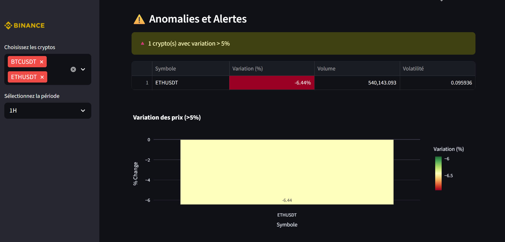

# Cas de traitement streaming

Cette section présente de manière détaillée la mise en œuvre du **traitement en streaming** appliqué aux données de marché issues de la plateforme Binance.  
Contrairement au traitement batch, le streaming vise à traiter les données **au fil de leur arrivée**, avec une faible latence, afin de réagir quasi instantanément aux nouveaux événements de marché.

---

## Mise en place de l’environnement de travail

La mise en œuvre du traitement streaming repose sur une **architecture hybride**, combinant des services conteneurisés et un moteur de calcul exécuté localement.

Plus précisément :

  - **Docker** est utilisé pour exécuter les services d’infrastructure (Kafka, Zookeeper, PostgreSQL) dans des environnements isolés et reproductibles ;
  - **Apache Spark** est exécuté en local (hors conteneur), afin de faciliter le développement, le débogage et l’observation des traitements.

Cette approche permet de bénéficier à la fois :
  - de la **reproductibilité** offerte par Docker,
  - et de la **simplicité de développement** d’un Spark local.

---

## Installation et configuration d’Apache Spark en local

Le traitement streaming est réalisé à l’aide d’Apache Spark exécuté directement sur une machine Windows.

### Installation d’Apache Spark

La version suivante a été utilisée :

- **Apache Spark 4.0.1** (`spark-4.0.1-bin-hadoop3.tgz`)

Apache Spark est développé en **Scala** et repose sur l’écosystème Hadoop. Même lorsque les traitements sont écrits en Python (via PySpark), Spark s’exécute sur la **Java Virtual Machine (JVM)**.

### Spécificités Windows

Sous Windows, certaines dépendances Hadoop ne sont pas disponibles nativement. Afin d’assurer le bon fonctionnement de Spark, les éléments suivants ont été ajoutés :

- `winutils.exe`
- `hadoop.dll`

Ces fichiers sont nécessaires pour :
- la gestion correcte du système de fichiers,
- certaines opérations internes de Spark et Hadoop.

Sans ces composants, Spark peut démarrer mais échouer lors de traitements plus avancés.

---

## Rôle de Docker dans le projet

### Pourquoi utiliser Docker ?

Docker est une plateforme de **conteneurisation** permettant d’exécuter des applications dans des environnements isolés, incluant toutes leurs dépendances.

Dans le cadre de ce projet, Docker permet de :

  - déployer rapidement les services nécessaires au streaming,
  - éviter les conflits de versions entre machines,
  - garantir un environnement d’exécution reproductible.

Contrairement à une machine virtuelle complète, Docker :

  - partage le noyau du système hôte,
  - est plus léger,
  - démarre plus rapidement.

### Docker Desktop sous Windows

Docker repose sur des mécanismes propres au noyau Linux. Sous Windows, Docker Desktop s’appuie donc sur **WSL2** ou **Hyper-V** afin d’exécuter une machine Linux légère permettant au moteur Docker de fonctionner correctement.

---

## Orchestration des services avec *docker-compose*

Afin de gérer plusieurs services simultanément, un fichier `docker-compose.yml` a été utilisé.

Ce fichier permet de :

  - définir plusieurs services dans un seul document,
  - configurer les ports, volumes et réseaux,
  - lancer ou arrêter l’ensemble de l’infrastructure avec une seule commande.

### Services déployés

Dans le cadre de ce projet, `docker-compose` permet de lancer :

  - **Zookeeper**, nécessaire à la coordination de Kafka ;
  - **Kafka**, utilisé pour la gestion des flux de données en temps réel ;
  - **PostgreSQL**, utilisé pour le stockage persistant des données traitées.

Apache Spark n’est pas conteneurisé et reste exécuté localement.

### Image Docker et conteneur Docker

Il convient de distinguer :

  - une **image Docker**, qui correspond à un modèle statique contenant l’application et ses dépendances ;
  - un **conteneur Docker**, qui est une instance active créée à partir de cette image.

<div style="max-width: 980px; margin: 0 auto; padding: 8px 0;">
  
  <div style="font-size:0.9em; color:#555; margin-top:8px; text-align:center;">
  </div>
</div>


### Lancement des services

Les services sont démarrés à l’aide de la commande suivante :

```bash 
docker compose up -d
```

Une fois cette commande exécutée, l’ensemble des services devient accessible via les ports définis dans le fichier de configuration.

---

## Kafka : organisation du streaming des données

Le cœur de l’architecture de streaming repose sur **Apache Kafka**, qui joue le rôle de système de messagerie distribué et tolérant aux pannes. Kafka permet de découpler la **production des données** de leur **traitement**, tout en garantissant un débit élevé et une faible latence.

---

### Notion de *topic* Kafka

Dans Kafka, les données sont organisées autour du concept de **topic**.  
Un topic peut être vu comme un **canal de diffusion** dans lequel circulent des messages.

Un topic met en relation deux types d’acteurs :

  - un **producer**, qui publie (écrit) les messages dans le topic ;
  - un **consumer**, qui s’abonne au topic pour lire les messages.

Chaque topic est découpé en **partitions**. Cette organisation permet :

  - le **parallélisme**, car plusieurs consommateurs peuvent lire différentes partitions en parallèle ;
  - la **montée en charge**, en répartissant les données sur plusieurs partitions ;
  - la **conservation temporaire des messages**, ce qui permet de relire les données si nécessaire.

Kafka garantit ainsi un stockage fiable des flux entrants, même en cas de pic de charge ou de ralentissement du système de traitement.

---

### Topic utilisé dans le projet

Dans le cadre de ce projet, un seul topic Kafka a été créé :

- `projet-bdcc`

Ce topic centralise l’ensemble des messages de marché transmis en temps réel depuis la plateforme Binance.  
Il constitue le point d’entrée unique des données streaming avant leur traitement par Apache Spark.

---

## Extraction des données en temps réel : WebSocket Binance vers Kafka

### Principe du WebSocket

Un **WebSocket** est un protocole de communication permettant d’établir une connexion persistante entre un client et un serveur.  
Contrairement aux requêtes HTTP classiques, la connexion reste ouverte et permet l’échange de données **en continu**, sans avoir à relancer de nouvelles requêtes.

Ce mécanisme est particulièrement adapté aux cas d’usage temps réel, où les données sont produites de manière fréquente et imprévisible.

---

### Flux Binance utilisé

Les données de marché sont récupérées à partir du flux WebSocket public fourni par Binance : wss://stream.binance.com:9443/ws/!miniTicker@arr

Ce flux diffuse en continu des informations de marché pour un grand nombre de paires de cryptomonnaies.  
Les messages sont transmis sous forme **JSON**, chaque message correspondant à un événement de marché (mise à jour de prix, volumes, etc.).

---

### Envoi des données vers Kafka

Une fois la connexion WebSocket établie :

  - chaque message reçu est immédiatement pris en charge par un **Kafka Producer** ;
  - le message est publié dans le topic `projet-bdcc`.

<div style="max-width: 980px; margin: 0 auto; padding: 8px 0;">
  
  <div style="font-size:0.9em; color:#555; margin-top:8px; text-align:center;">
  </div>
</div>

Kafka joue ainsi le rôle de **tampon fiable** entre la source de données (Binance) et le moteur de calcul (Apache Spark).  
Cette architecture permet de :

  - absorber les variations de débit des données entrantes ;
    - garantir qu’aucune donnée ne soit perdue ;
- découpler la collecte des données de leur traitement analytique.

---

## Traitement des flux avec Spark Structured Streaming

Les messages stockés dans Kafka sont ensuite consommés par Apache Spark à l’aide du module **Structured Streaming**.

Spark Structured Streaming permet de traiter des flux de données continus en s’appuyant sur le modèle des **DataFrames**, déjà utilisé pour les traitements batch.

Concrètement, Spark assure les opérations suivantes :

  - lecture continue des messages depuis le topic Kafka ;
  - parsing et désérialisation des messages JSON ;
  - normalisation des champs (prix, volumes, horodatage, symboles, etc.) ;
  - application de transformations et de calculs analytiques en temps réel.

<div style="max-width: 980px; margin: 0 auto; padding: 8px 0;">
  
  <div style="font-size:0.9em; color:#555; margin-top:8px; text-align:center;">
  </div>
</div>

Grâce à cette approche, les traitements streaming restent proches des traitements batch classiques, ce qui facilite :

  - la compréhension du code,
  - la maintenance,
  - et l’évolution du pipeline analytique.

---

## Stockage des données traitées dans PostgreSQL

Une fois les données traitées par Spark, elles sont stockées dans une base de données relationnelle afin d’assurer leur persistance et leur exploitation ultérieure.

<div style="max-width: 980px; margin: 0 auto; padding: 8px 0;">
  
  <div style="font-size:0.9em; color:#555; margin-top:8px; text-align:center;">
  </div>
</div> 

Dans l’architecture mise en place :

- **PostgreSQL** s’exécute dans un conteneur Docker ;
- Apache Spark écrit les données via une connexion **JDBC** ;
- les données sont insérées ou mises à jour selon la logique définie dans le projet.

---

## Dashboard

Un tableau de bord interactif a été développé avec **Streamlit** afin de visualiser, en quasi temps réel, les données de marché issues de Binance et traitées par le pipeline de streaming. 

### Architecture et flux de données

Le dashboard se connecte directement à la base **PostgreSQL** (via `SQLAlchemy`) contenant une table `projet_bdcc`. À chaque rafraîchissement, l’application exécute une requête SQL filtrant les observations selon :

  - une sélection de cryptomonnaies (`symbol`) choisie dans la barre latérale ;
  - une limite d’observations (`LIMIT`) afin de contrôler le volume chargé en mémoire ;
  - un tri temporel sur `timestamp_ts` afin de reconstruire correctement les séries temporelles.

Les données sont ensuite converties en `DataFrame` Pandas pour permettre la production rapide de métriques et de graphiques.

### Rafraîchissement automatique et logique de cache

Le suivi temps réel est assuré par un **auto-refresh** (`streamlit_autorefresh`) déclenché toutes les `REFRESH_INTERVAL = 5` secondes. Ce mécanisme permet de recharger les données en continu sans intervention manuelle.

Pour éviter des requêtes inutiles et améliorer la performance, le chargement est encapsulé dans une fonction décorée par `@st.cache_data` avec un *TTL* (Time To Live). Ainsi, sur un court intervalle, Streamlit réutilise le résultat en cache plutôt que de relancer systématiquement la requête.

### Enrichissement des données : indicateurs calculés côté dashboard

Après chargement, l’application calcule plusieurs indicateurs dérivés afin d’obtenir des mesures directement interprétables :

  - **Variation relative (%)** : Cet indicateur mesure le rendement sur la période observée.

  - **Volatilité relative** : Il donne une approximation de l’amplitude des fluctuations, normalisée par le prix.

  - **Spread** : Il représente l’écart absolu entre le maximum et le minimum observés sur la période.

Ces calculs sont effectués à l’affichage afin de rendre l’interface autonome, tout en laissant la persistance se concentrer sur les variables brutes essentielles.

### Paramétrage utilisateur (Sidebar)

La barre latérale permet :

  - de sélectionner les cryptomonnaies à suivre (`multiselect`) à partir de la liste des symboles disponibles en base ;
  - de filtrer la période d’observation (`1H`, `24H`, `7J`, `30J`, `Tout`) via un filtre temporel appliqué sur `timestamp_ts` ;

Ce choix d’interface permet à l’utilisateur d'adapter dynamiquement le périmètre d’analyse sans modifier le code.


### Organisation fonctionnelle du dashboard (onglets)

Le dashboard est structuré en cinq onglets principaux, chacun répondant à un besoin analytique complémentaire.

#### *Overview* : résumé par actif

L’onglet **Overview** fournit, pour chaque crypto sélectionnée :

  - le dernier prix de clôture ;
  - la variation absolue et relative sur la période filtrée ;
  - des statistiques agrégées : prix moyen, maximum, minimum, volatilité moyenne et volume cumulé.
  
<div style="max-width: 980px; margin: 0 auto; padding: 8px 0;">
  
  <div style="font-size:0.9em; color:#555; margin-top:8px; text-align:center;">
  </div>
</div>

Ces métriques sont affichées sous forme de *cards* et de blocs synthétiques afin de faciliter une lecture rapide de l’état du marché.

#### *Graphiques* : volume et tendances

L’onglet **Graphiques** propose, pour chaque crypto :

  - un graphique *candlestick* (Open/High/Low/Close) ;
  - deux **moyennes mobiles** (`MA7`, `MA25`) pour visualiser la tendance ;
  - un histogramme de **volume** superposé.

<div style="max-width: 980px; margin: 0 auto; padding: 8px 0;">
  
  <div style="font-size:0.9em; color:#555; margin-top:8px; text-align:center;">
  </div>
</div>

L’objectif est de combiner sur une même vue :

  - la dynamique des prix,
  - les zones de volatilité,
  - et l’intensité des échanges (liquidité via le volume).

#### *Top Cryptos* : classements et comparaison

L’onglet **Top Cryptos** construit des classements à partir de la dernière observation de chaque symbole :

  - **Top 5 par volume** (actifs les plus échangés) ;
  - **Top Gainers** (plus fortes hausses, via `pct_change`) ;
  - **Top Losers** (plus fortes baisses).

<div style="max-width: 980px; margin: 0 auto; padding: 8px 0;">
  
  <div style="font-size:0.9em; color:#555; margin-top:8px; text-align:center;">
  </div>
</div>
Deux visualisations complémentaires sont proposées :

  - évolution des *gainers* sous forme d’indice base 100 (comparabilité des trajectoires) ;
  - barres de variation (%) pour les *losers* (lecture immédiate des chutes).

#### *Anomalies* : alertes de marché

L’onglet **Anomalies** détecte des comportements atypiques sur la dernière observation disponible :

  - **Variations extrêmes** : \(|pct\_change| > 5\%\)  
  - **Volatilité élevée** : sélection des symboles au-dessus du 3e quartile de `volatility`

<div style="max-width: 980px; margin: 0 auto; padding: 8px 0;">
  
  <div style="font-size:0.9em; color:#555; margin-top:8px; text-align:center;">
  </div>
</div> 

Les anomalies sont accompagnées :

  - de tableaux stylisés (gradients),
  - et de graphiques en barres pour synthétiser les alertes.

Cette partie vise à fournir un mécanisme simple de *surveillance* du marché, utile pour identifier rapidement les actifs “instables” ou “en mouvement”.

#### *Détails Crypto* : focus sur un actif

L’onglet **Détails Crypto** permet une analyse approfondie d’un actif choisi :

  - tableau récapitulatif des dernières valeurs (Open, Close, High, Low, spread, variation, volatilité, volume) ;
  - graphique High/Low + moyennes mobiles ;
  - graphique de volume ;
  - historique complet formaté (table interactive) avec mise en évidence de la variation et de la volatilité.

<div style="max-width: 980px; margin: 0 auto; padding: 8px 0;">
  
  <div style="font-size:0.9em; color:#555; margin-top:8px; text-align:center;">
  </div>
</div>

Cette vue détaillée permet à l'utilisation, après une observation globale, d'explorer un actif en profondeur.


#### Apport du dashboard dans le pipeline streaming

Le dashboard Streamlit matérialise la dernière étape du pipeline en offrant :

  - une **visualisation quasi temps réel** des données ingérées en streaming,
  - une capacité de **monitoring** via des indicateurs et alertes,
  - une **interface interactive** facilitant l’exploration des séries temporelles et des anomalies,
  - une exploitation directe des données persistées dans PostgreSQL, sans dépendre d’un environnement de développement.

En pratique, il constitue un composant clé pour démontrer la valeur du streaming : au lieu d’attendre un traitement batch, l’information est consultable dès qu’elle est disponible dans la base, avec un rafraîchissement automatique.

</div>


