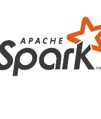

# Apache Spark

  
  
Agence nationale de la Statistique et de la Démographie (ANSD)

  
  
École nationale de la Statistique et de l’Analyse économique Pierre Ndiaye (ENSAE)

 
 
Présentation du projet du groupe 7 – Année académique 2025-2026

  Spark : Traitement des données massives 
  en temps réel

  
 

 
Rédigé par
 

 COMPAORE Bassirou  DIAKHATE Khadidiatou  DIALLO Aissatou  FOGWOUNG DJOUFACK Sarah-Laure  FOUMSOU Lawa Prosper 
 
Élèves ingénieurs statisticiens économistes (ISE2)
 
 
 
Sous la supervision de
 

Mme DIAW Mously
 

Freelance Senior Data Scientist / ML Engineer
 
Livre réalisé dans le cadre du cours d’Initiation au Big Data &amp; Cloud Computing.

 
 

